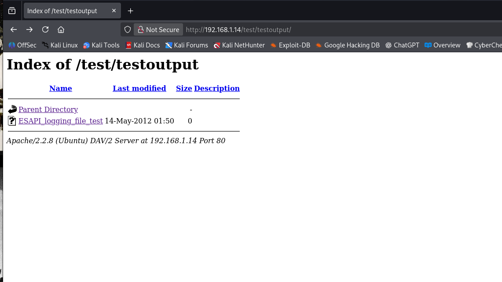

# Metasploit2
The goal of this repo is to make a step by step tutorial of metasploit 2. This repo will cover the things that i tried from my existing knowledge to the things that i learned by researching. Hopefully i try all the possible ways there is to break into this machine.

The first step of any engagement is reconnaissance.

# Reconnaissance

Since we cant do passive recon on this target we will start with active reconnaissance and map everything we find.

## Nmap 

Since its Metasploit2 as the target i will try the **-T5** flag to speed up the process. Usually we would be more careful by using the default (-T4) or be a bit more careful by dropping to **-T3**. The lower the number the more time it takes for the process to be complete but this gives us stealth so we dont throw off any alarms in the target. 

So first I checked the help manual of Nmap. I decided to do first a **host discovery scan**. (Note: Smtime scans can throw false-positives so its good to do several ones before coming to conclusions.)

```
nmap -sn -T5 <ip>

Output:
                ***
MAC Address: <MAC> (Oracle VirtualBox virtual NIC)
Nmap scan report for <ip>
                *** 
```
+ This one checks all the ip range and treats them all as being awake. Gives lowkey a better result than the above one. 
```
nmap -Pn -T5 <ip>

Output:
Starting Nmap 7.99 ( https://nmap.org ) at 2026-07-25 13:51 -0400
Nmap scan report for <ip>
Host is up (0.0049s latency).
Not shown: 995 closed tcp ports (reset)
PORT   STATE    SERVICE
21/tcp filtered ftp
22/tcp filtered ssh
23/tcp open     telnet
53/tcp open     domain
80/tcp open     http
MAC Address: <MAC> (Huawei Technologies)

Nmap scan report for <ip>
Host is up (0.000050s latency).
Not shown: 977 closed tcp ports (reset)
PORT     STATE SERVICE
21/tcp   open  ftp
22/tcp   open  ssh
23/tcp   open  telnet
25/tcp   open  smtp
53/tcp   open  domain
80/tcp   open  http
111/tcp  open  rpcbind
139/tcp  open  netbios-ssn
445/tcp  open  microsoft-ds
512/tcp  open  exec
513/tcp  open  login
514/tcp  open  shell
1099/tcp open  rmiregistry
1524/tcp open  ingreslock
2049/tcp open  nfs
2121/tcp open  ccproxy-ftp
3306/tcp open  mysql
5432/tcp open  postgresql
5900/tcp open  vnc
6000/tcp open  X11
6667/tcp open  irc
8009/tcp open  ajp13
8180/tcp open  unknown
MAC Address: <MAC> (Oracle VirtualBox virtual NIC)

Nmap scan report for <ip>
Host is up (0.000025s latency).
All 1000 scanned ports on <ip> are in ignored states.
Not shown: 1000 closed tcp ports (reset)
MAC Address: <MAC> (Liteon Technology)

Nmap scan report for <ip>
Host is up.
All 1000 scanned ports on <ip> are in ignored states.
Not shown: 1000 filtered tcp ports (no-response)

Nmap done: 256 IP addresses (4 hosts up) scanned in 65.22 seconds

```
Well we can see the difference in these 2 commands. ( I could leave the IPs there because they are private IPs but it feels better this way.)

As u can see from the output i have 4 devices which i scanned and with the **-Pn** flag u get an idea of whats going on in most ports, forgot to add **-p-** to scan all the ports. 
The Liteon Tech is my PC and the Huawei is my router. Its obv who the Metasploit2 is right. 

+ Now lets make another scan for Metasploit2.
```
nmap -sCV -p- -T5 <ip>
```
This combines 2 type of scans:

` **-sV**:  Version scan`

`**-sC**:  Script default scan. This is the equivalent of --script=default. Usualy we use script scanning to check for vulnerabilities.`

```
Output:
Starting Nmap 7.99 ( https://nmap.org ) at 2026-07-25 14:06 -0400
Nmap scan report for <ip>
Host is up (0.0026s latency).
Not shown: 65505 closed tcp ports (reset)
PORT      STATE SERVICE     VERSION
21/tcp    open  ftp         vsftpd 2.3.4
| ftp-syst: 
|   STAT: 
| FTP server status:
|      Connected to <ip>
|      Logged in as ftp
|      TYPE: ASCII
|      No session bandwidth limit
|      Session timeout in seconds is 300
|      Control connection is plain text
|      Data connections will be plain text
|      vsFTPd 2.3.4 - secure, fast, stable
|_End of status
|_ftp-anon: Anonymous FTP login allowed (FTP code 230)
22/tcp    open  ssh         OpenSSH 4.7p1 Debian 8ubuntu1 (protocol 2.0)
| ssh-hostkey: 
|   1024 60:0f:cf:e1:c0:5f:6a:74:d6:90:24:fa:c4:d5:6c:cd (DSA)
|_  2048 56:56:24:0f:21:1d:de:a7:2b:ae:61:b1:24:3d:e8:f3 (RSA)
23/tcp    open  telnet      Linux telnetd
25/tcp    open  smtp        Postfix smtpd
| sslv2: 
|   SSLv2 supported
|   ciphers: 
|     SSL2_DES_64_CBC_WITH_MD5
|     SSL2_RC4_128_EXPORT40_WITH_MD5
|     SSL2_RC2_128_CBC_WITH_MD5
|     SSL2_RC2_128_CBC_EXPORT40_WITH_MD5
|     SSL2_RC4_128_WITH_MD5
|_    SSL2_DES_192_EDE3_CBC_WITH_MD5
|_smtp-commands: metasploitable.localdomain, PIPELINING, SIZE 10240000, VRFY, ETRN, STARTTLS, ENHANCEDSTATUSCODES, 8BITMIME, DSN
|_ssl-date: 2026-07-25T18:08:32+00:00; 0s from scanner time.
| ssl-cert: Subject: commonName=ubuntu804-base.localdomain/organizationName=OCOSA/stateOrProvinceName=There is no such thing outside US/countryName=XX
| Not valid before: 2010-03-17T14:07:45
|_Not valid after:  2010-04-16T14:07:45
53/tcp    open  domain      ISC BIND 9.4.2
| dns-nsid: 
|_  bind.version: 9.4.2
80/tcp    open  http        Apache httpd 2.2.8 ((Ubuntu) DAV/2)
|_http-title: Metasploitable2 - Linux
|_http-server-header: Apache/2.2.8 (Ubuntu) DAV/2
111/tcp   open  rpcbind     2 (RPC #100000)
| rpcinfo: 
|   program version    port/proto  service
|   100000  2            111/tcp   rpcbind
|   100000  2            111/udp   rpcbind
|   100003  2,3,4       2049/tcp   nfs
|   100003  2,3,4       2049/udp   nfs
|   100005  1,2,3      44593/udp   mountd
|   100005  1,2,3      56051/tcp   mountd
|   100021  1,3,4      35155/tcp   nlockmgr
|   100021  1,3,4      48944/udp   nlockmgr
|   100024  1          42404/udp   status
|_  100024  1          52037/tcp   status
139/tcp   open  netbios-ssn Samba smbd 3.X - 4.X (workgroup: WORKGROUP)
445/tcp   open  netbios-ssn Samba smbd 3.0.20-Debian (workgroup: WORKGROUP)
512/tcp   open  exec        netkit-rsh rexecd
513/tcp   open  login?
514/tcp   open  tcpwrapped
1099/tcp  open  java-rmi    GNU Classpath grmiregistry
1524/tcp  open  bindshell   Metasploitable root shell
2049/tcp  open  nfs         2-4 (RPC #100003)
2121/tcp  open  ftp         ProFTPD 1.3.1
3306/tcp  open  mysql       MySQL 5.0.51a-3ubuntu5
| mysql-info: 
|   Protocol: 10
|   Version: 5.0.51a-3ubuntu5
|   Thread ID: 8
|   Capabilities flags: 43564
|   Some Capabilities: LongColumnFlag, Speaks41ProtocolNew, ConnectWithDatabase, SupportsTransactions, SupportsCompression, SwitchToSSLAfterHandshake, Support41Auth
|   Status: Autocommit
|_  Salt: c1e*BL7l?3!H*9~1v"@[
3632/tcp  open  distccd     distccd v1 ((GNU) 4.2.4 (Ubuntu 4.2.4-1ubuntu4))
5432/tcp  open  postgresql  PostgreSQL DB 8.3.0 - 8.3.7
|_ssl-date: 2026-07-25T18:08:32+00:00; 0s from scanner time.
| ssl-cert: Subject: commonName=ubuntu804-base.localdomain/organizationName=OCOSA/stateOrProvinceName=There is no such thing outside US/countryName=XX
| Not valid before: 2010-03-17T14:07:45
|_Not valid after:  2010-04-16T14:07:45
5900/tcp  open  vnc         VNC (protocol 3.3)
| vnc-info: 
|   Protocol version: 3.3
|   Security types: 
|_    VNC Authentication (2)
6000/tcp  open  X11         (access denied)
6667/tcp  open  irc         UnrealIRCd
6697/tcp  open  irc         UnrealIRCd
8009/tcp  open  ajp13       Apache Jserv (Protocol v1.3)
|_ajp-methods: Failed to get a valid response for the OPTION request
8180/tcp  open  http        Apache Tomcat/Coyote JSP engine 1.1
|_http-server-header: Apache-Coyote/1.1
|_http-favicon: Apache Tomcat
|_http-title: Apache Tomcat/5.5
8787/tcp  open  drb         Ruby DRb RMI (Ruby 1.8; path /usr/lib/ruby/1.8/drb)
35155/tcp open  nlockmgr    1-4 (RPC #100021)
52037/tcp open  status      1 (RPC #100024)
53381/tcp open  java-rmi    GNU Classpath grmiregistry
56051/tcp open  mountd      1-3 (RPC #100005)
MAC Address: <MAC> (Oracle VirtualBox virtual NIC)
Service Info: Hosts:  metasploitable.localdomain, irc.Metasploitable.LAN; OSs: Unix, Linux; CPE: cpe:/o:linux:linux_kernel

Host script results:
|_smb2-time: Protocol negotiation failed (SMB2)
| smb-security-mode: 
|   account_used: guest
|   authentication_level: user
|   challenge_response: supported
|_  message_signing: disabled (dangerous, but default)
|_clock-skew: mean: 1h00m00s, deviation: 2h00m00s, median: 0s
|_nbstat: NetBIOS name: METASPLOITABLE, NetBIOS user: <unknown>, NetBIOS MAC: <unknown> (unknown)
| smb-os-discovery: 
|   OS: Unix (Samba 3.0.20-Debian)
|   Computer name: metasploitable
|   NetBIOS computer name: 
|   Domain name: localdomain
|   FQDN: metasploitable.localdomain
|_  System time: 2026-07-25T14:08:22-04:00

Service detection performed. Please report any incorrect results at https://nmap.org/submit/ .
Nmap done: 1 IP address (1 host up) scanned in 142.41 seconds
```
Now we need to disect and make a research for each service and propable vulnerability that **Nmap** gave us. 

### The reconnaissance is over , right ?! 
Analysing the output from Nmap we can see that we have some ways to break in.

 Usually hackers attackers go for the lowest hanging fruit. Meaning that when u see something interesting and easy ,we might give it a try to break in.
 
 **Or maybe u can approach this differently in a more organised way lets say and map everything out before going to the next phase.**

**Which is what I will try to do for the first time, I usually go for the 1st method**

### Enumeration 

Since we have all the ports of the device , we taking reconnaisance a step further. We first will check the port running a webserver.

The ports : 

    80/tcp    open  http        Apache httpd 2.2.8 ((Ubuntu) DAV/2)
    |_http-title: Metasploitable2 - Linux
    |_http-server-header: Apache/2.2.8 (Ubuntu) DAV/2

    513/tcp   open  login?

    8180/tcp  open  http        Apache Tomcat/Coyote JSP engine 1.1
    |_http-server-header: Apache-Coyote/1.1
    |_http-favicon: Apache Tomcat
    |_http-title: Apache Tomcat/5.5

    52037/tcp open  status      1 (RPC #100024)

    56051/tcp open  mountd      1-3 (RPC #100005)

I will start the enumeration from here. Now not all of the services are HTTP as i said but i got curious and put some other that i didnt know what are for. 

**The 80 port**

    Running Apache httpd

    Opened the IP on firefox on my VM and a page like this opens:


We are not going to jump into exploiting yet. But will map these endpoints:

    TWiki
    phpMyAdmin
    Mutillidae
    DVWA
    WebDAV

* Did a subenum for the domain. Here is what `ffuf` gave out. 


        ffuf -w /usr/share/wordlists/dirbuster/directory-list-2.3-medium.txt -u http://192.168.1.14/FUZZ -t 200 -e .php,.html,.txt,.sql,.bak,.db,.xml,.config,.git 

        /'___\  /'___\           /'___\       
       /\ \__/ /\ \__/  __  __  /\ \__/       
       \ \ ,__\\ \ ,__\/\ \/\ \ \ \ ,__\      
        \ \ \_/ \ \ \_/\ \ \_\ \ \ \ \_/      
         \ \_\   \ \_\  \ \____/  \ \_\       
          \/_/    \/_/   \/___/    \/_/       

       v2.1.0-dev
        ________________________________________________

         :: Method           : GET
         :: URL              : http://192.168.1.14/FUZZ
         :: Wordlist         : FUZZ: /usr/share/wordlists/dirbuster/directory-list-2.3-medium.txt
         :: Extensions       : .php .html .txt .sql .bak .db .xml .config .git 
         :: Follow redirects : false
         :: Calibration      : false
         :: Timeout          : 10
        :: Threads          : 200
         :: Matcher          : Response status: 200-299,301,302,307,401,403,405,500
        ________________________________________________


        tikiwiki                [Status: 301, Size: 320, Words: 21, Lines: 10, Duration: 16ms]
        .html                   [Status: 403, Size: 290, Words: 22, Lines: 11, Duration: 1ms]
        [Status: 200, Size: 891, Words: 237, Lines: 30, Duration: 399ms]
        phpinfo                 [Status: 200, Size: 48029, Words: 2409, Lines: 657, Duration: 579ms]
        phpinfo.php             [Status: 200, Size: 48041, Words: 2409, Lines: 657, Duration: 610ms]
        server-status           [Status: 403, Size: 298, Words: 22, Lines: 11, Duration: 50ms]
        phpMyAdmin              [Status: 301, Size: 322, Words: 21, Lines: 10, Duration: 7ms]
        test                    [Status: 301, Size: 316, Words: 21, Lines: 10, Duration: 9ms]

Now as u see some of these are from the list before, so i wont touch them. But what i will do is check what the rest of these have.

* tikiwiki:


* test:

Here was only 1 subdir so i opnened it and this was the final destination.

**The port 8180** 

Just entered the port and this is the page that was shown to me:


* Did enumeration on this and we have :
                
        manager                 [Status: 302, Size: 0, Words: 1, Lines: 1, Duration: 2002ms]
                
        webdav                  [Status: 200, Size: 1775, Words: 75, Lines: 31, Duration: 521ms]
                
        /                       [Status: 200, Size: 8692, Words: 2370, Lines: 235, Duration: 64ms]
                
        RELEASE-NOTES.txt       [Status: 200, Size: 7498, Words: 948, Lines: 197, Duration: 107ms]

Honestly after checking each of these ( except for the webdav ) didnt find anything worth working. Might enum again each of the dirs to see if there is anything at all.

